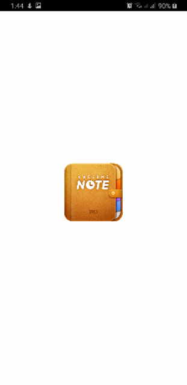
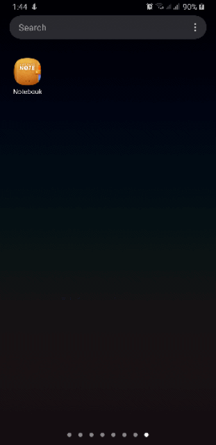
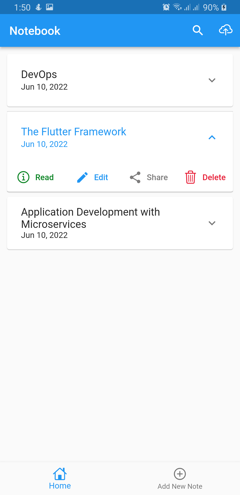

# Note Keeping App 
### Offline & Cloud Support Provided.
This is a note keeking that helps users to organized their notes with both offline and cloud support.

## Getting Started

This project is a starting point for a Flutter application.

### Features of the app:
      - Add note.
      - View notes.
      - Edite notes.
      - Delete notes.
      - Search note by title or date.
      - user onboarding screens provided.
      - Sync/upload notes with your Google account.
      - Share notes with friends via email, whatsApp, Facebook, Telegram, etc.
      
## Extra:
    1. Automatically check for new update of the app in production (users will just tap update to install the new update)
    2. User validation implemented | Note title: Required
    3. Internet connectivity implemented to ensure users are connected to internet before syncing notes with their Google Account.

### To use this project:
    1. Clone the project.
    2. Add the project to firebase.
    3. Replace google_services.json file located in the app level.
  

### How to generate SHA-1 for firebase project:
#### Windows:
    keytool -list -v -keystore "%USERPROFILE%\.android\debug.keystore" -alias androiddebugkey -storepass android -keypass android

#### Linux & MacOS:
    keytool -list -v -keystore ~/.android/debug.keystore -alias androiddebugkey -storepass android -keypass android 

#### Alternatively: move to the android directory and execute the code below:
    gradlew signingreport

### Flutter packages used:
    cupertino_icons: ^1.0.2
    hive: ^2.2.1
    hive_flutter: ^1.1.0
    get: ^4.6.5
    flutter_smart_dialog: ^3.4.1
    lottie: ^1.3.0
    intl: ^0.17.0
    awesome_dialog: ^2.2.1
    shared_preferences: ^2.0.13
    flutter_share: ^2.0.0
    firebase_core: ^1.15.0
    firebase_auth: ^3.3.15
    google_sign_in: ^5.3.0
    googleapis: ^9.1.0
    connectivity_plus: ^2.2.1

### You need to create projects on the following platforms:

- [Firebase](https://console.firebase.google.com)
- [GCP: Google Cloud Platform](https://console.cloud.google.com)

